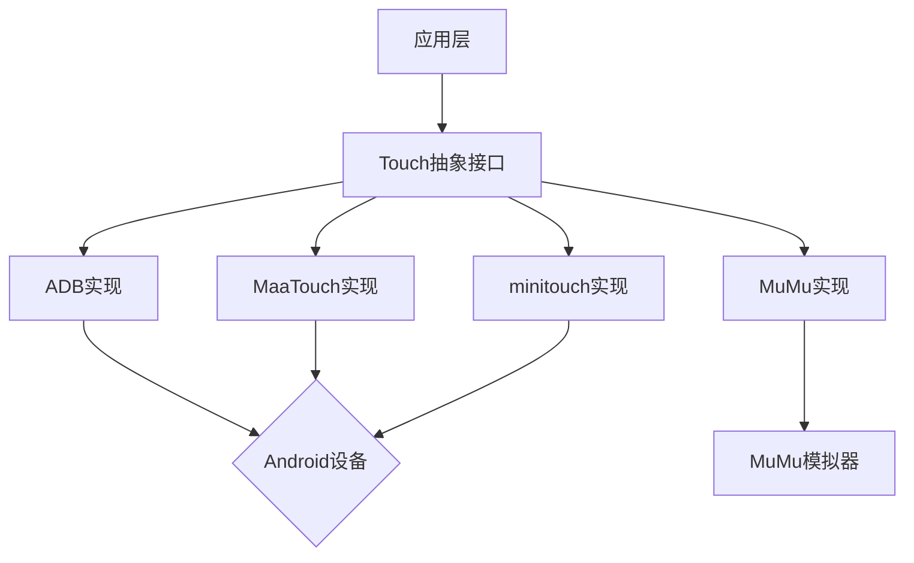

# MTC (Multi-Touch Control) 框架

## 🌟 特性

- 统一的触摸控制抽象接口
- 支持多种底层实现：
  - ADB 原生指令
  - MaaTouch 高性能方案
  - minitouch 低延迟方案
  - MuMu 模拟器专属支持

## 📦 安装

```bash
# 全量安装
uv add git+https://github.com/NakanoSanku/mtc
# 选择性安装
# 仅安装minitouch方案
uv add git+https://github.com/NakanoSanku/mtc#subdirectory=mtc-minitouch
```

## 🛠️ 实现方案对比

| 特性       | ADB  | MaaTouch | minitouch                      | MuMu        |
| ---------- | ---- | -------- | ------------------------------ | ----------- |
| 延迟       | 高   | 低       | 最低                           | 最低        |
| 需要 root  | 否   | 否       | 否                             | 否          |
| 多指支持   | 单指 | 多指     | 多指                           | 单指        |
| 设备兼容性 | 通用 | 通用     | 通用（不支持 Android 13 以上） | MuMu12 专属 |

## 🚀 快速开始

```python
from mtc.touch import Touch
from mtc.adb import ADBTouch
from mtc.maatouch import MaaTouch
from mtc.minitouch import MiniTouch
from mtc.mumu import MuMuTouch

# 通用接口调用示例
def perform_click(controller: Touch):
    controller.click(100, 100, duration=150)

perform_click(ADBTouch("emulator-5554"))
perform_click(MaaTouch("127.0.0.1:7555"))
# perform_click(MiniTouch("emulator-5554"))
perform_click(MuMuTouch(0))

def perform_swipe(controller: Touch):
    controller.swipe([(100,100),(500,500)], duration=150)

perform_swipe(ADBTouch("emulator-5554"))
perform_swipe(MaaTouch("127.0.0.1:7555"))
# perform_swipe(MiniTouch("emulator-5554"))
perform_swipe(MuMuTouch(0))
```

## 📚 模块架构



## 📄 核心模块

### mtc-base

基础抽象层，定义了`Touch`抽象基类。

### mtc-adb

使用 ADB 命令实现的触摸控制。

### mtc-maatouch

使用 MaaTouch 方案实现高性能触摸控制。

### mtc-minitouch

使用 minitouch 方案实现低延迟触摸控制。

### mtc-mumu

针对 MuMu 模拟器的触摸控制实现。

## ✅ TODO

- [ ] 部分支持多点触控
- [ ] 部分支持手势操作

## 🤝 贡献指南

请参考[贡献指南](CONTRIBUTING.md)。
